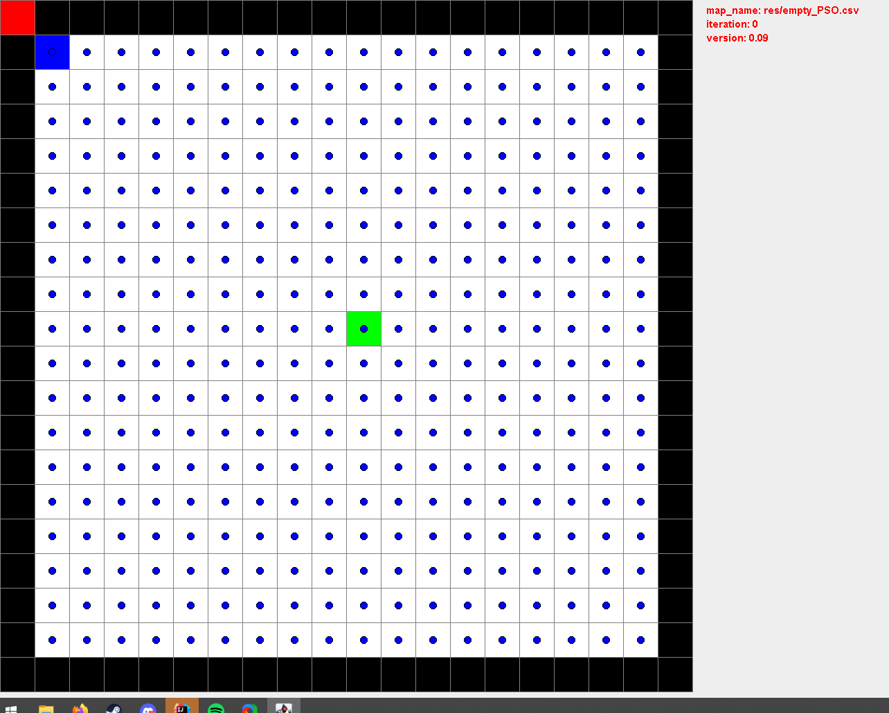
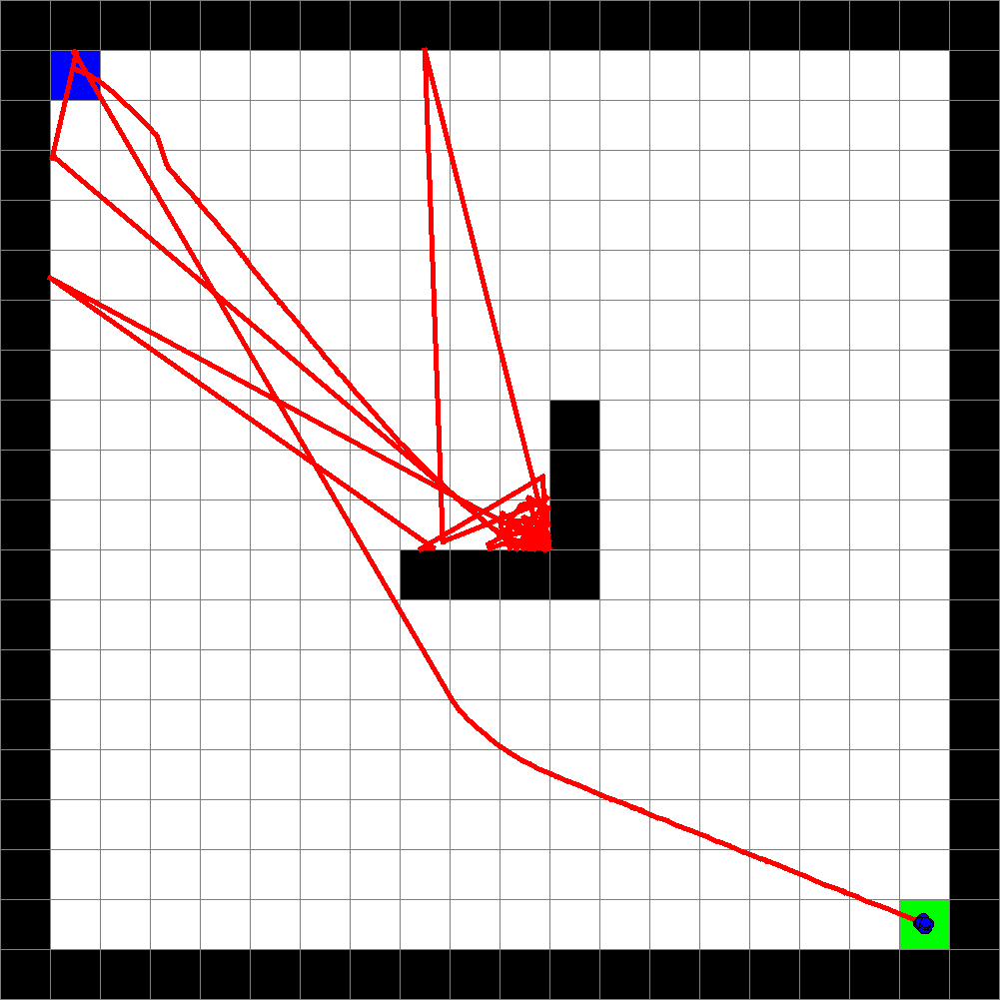
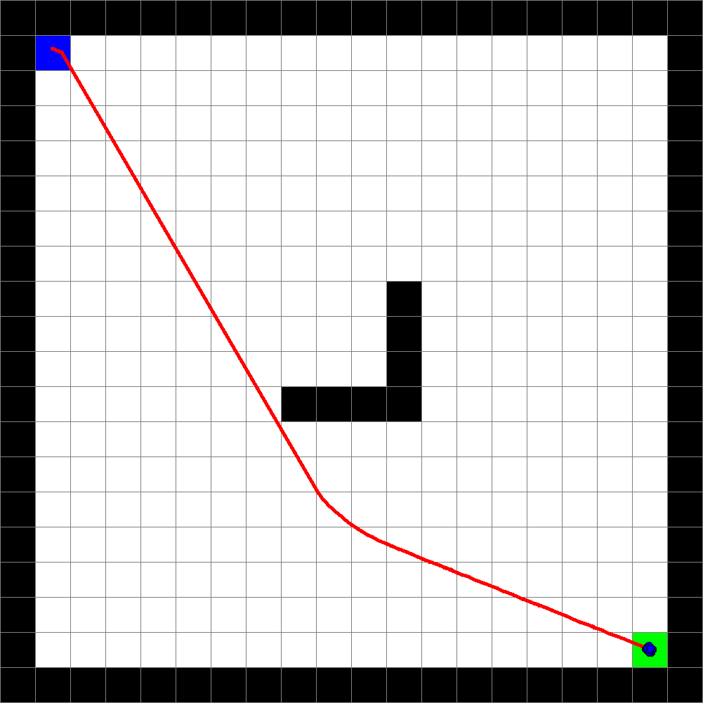

# Particle Swarm Optimization for Pathfinding
a student project from flipketzi (https://github.com/flipketzi) and Ocepris

## Introduction
In this project we tried to solve pathfinding problems using Particle Swarm Optimization. 
We created a 2d environment with different blocks to test our approach. Black blocks for walls, blue for the start point and red as goal.

## Problems

The strength of the PSO algorithm comes from the distribution of the particles in the space. Due to the nature of Pathfinding problems we had to define a fixed start point which was a huge problem as the particles now got stuck in local optima.

## Solutions

Our solution was it to disable the swarm properties of the particles to random search if they didnt improve their personal best position after a certain amount of time. 

Now the particles were able to find the goal, but the found path was quite chaotic.

To get a shorter path optimized the path by removing all intersections. 

1. Search for intersections in path
2. Cut unnecessary path from intersection point to intersection point
3. Repeat until there are no more intersections left

## PSO for Pathfinding on a test map

Here in this example you can see the whole algorithm at work

